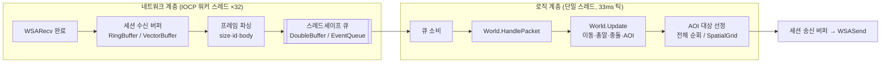

# IOCP 기반 실시간 대전 게임 서버

Windows **IOCP**로 구현한 C++ 멀티스레드 게임 서버입니다. 실시간 top-down 슈팅 게임(이동·사격·파괴 가능한 벽·관전)을 동작시키면서, 서버를 만들 때 마주치는 **핵심 설계 선택 3가지를 각각 두 가지 방식으로 직접 구현하고 실측 비교**하는 것을 목표로 했습니다.

> 단순히 "돌아가는 서버"가 아니라, 각 계층에서 왜 그 자료구조/알고리즘을 골랐는지 **직접 만들어 재보고 근거를 남기는 것**이 이 프로젝트의 핵심입니다.

---

## 기술 스택

| 구분 | 내용 |
|---|---|
| 서버 | C++17, Winsock2 **IOCP**, 멀티스레드(워커 32) + 단일 로직 스레드 |
| 클라이언트 | Go — 렌더링 클라(ebiten) / 헤드리스 부하 봇 |
| 측정 | `std::chrono` 틱 타이밍, `psapi` 메모리(Working Set / Peak) |

---

## 아키텍처



- **수신**: IOCP 워커 스레드 32개가 `WSARecv` 완료를 받아 세션별 수신 버퍼에 쌓고, `[size(2) | id(2) | body]` 프레임을 파싱해 `RecvPacket`을 **스레드세이프 큐**에 넣습니다.
- **로직**: 단일 로직 스레드가 33ms(~30Hz)마다 큐를 비우고 패킷을 처리한 뒤, 각 방(World)의 `Update`를 돌립니다. 단일 스레드라 게임 상태에 락이 필요 없습니다.
- **송신**: 로직 스레드가 세션 송신 버퍼에 기록(`sendLock`) → `flushSend`가 `WSASend`.
- **규모**: 방(World) 2개, 방당 최대 200명(`MAX_PLAYER`), 총알 4096(`MAX_BULLETS`) → 동시 400명 부하.
- **세션 관리**: `ObjectPool<Session, 1000>` 고정 배열 + free-list.

### 게임 규칙 요약
격자 맵(100×100 셀, 셀당 50유닛)에 랜덤 벽 배치(연결성 보장). 플레이어는 WASD 이동·마우스 사격, 총알은 벽을 파괴, 피격 시 관전 모드로 전환, 마지막 1명이 남으면 매치 종료. 클라이언트는 **시야(Line-of-Sight) + 반경 기반 전장의 안개**를 적용하며, 서버는 각 플레이어에게 보이는 대상만 보내는 **AOI(Area of Interest)** 갱신을 수행합니다.

---

## 핵심 실험 3가지

### 실험 1 — 세션 → 로직 스레드 전달 큐: 더블 스왑 버퍼 vs 이벤트 큐

**배경.** 워커 스레드 32개가 수신한 패킷을 단일 로직 스레드로 넘기려면 스레드세이프 큐가 필요합니다. Go에서 흔한 채널(이벤트 큐) 방식과, 락 경합을 줄이기 위한 더블 버퍼 스왑 방식을 비교했습니다.

| 방식 | 구조 | 락 특성 |
|---|---|---|
| **이벤트 큐** (`EventQueue.h`) | 단일 `std::queue` + 뮤텍스 | push·pop **매 건마다** 락 |
| **더블 스왑 버퍼** (`DoubleBuffer.h`) | write 버퍼 / 읽기용 버퍼 2개 | 워커는 push 시만 락, 로직 스레드는 **틱당 1회 swap** |

**가설.** 패킷이 몰리면 이벤트 큐는 워커↔로직 스레드 락 경합으로 메인 루프가 지연될 것이다.

**방법.** 헤드리스 부하 봇(Go 고루틴)으로 동시 400명 접속(방당 200), 워커 32스레드, 봇당 10ms 주기 송신. `USE_EVENT_QUEUE` 매크로로 전환하며 120초 측정.

**결과.**
- 예상과 달리 **한 틱 전체 소요 시간에서는 차이가 게임 로직 연산량에 묻혀** 잘 드러나지 않았음.
- 그래서 지표를 **순수 큐 소비 시간(Consume Time)** 으로 분리 측정 → **더블 스왑 방식이 약 2~3배 빠른 소비 속도** 확인.

**결론.** 락 경합의 이점은 "전체 틱"이 아니라 **큐 소비 구간**에서 측정해야 드러난다. 부하가 게임 로직에 비해 충분히 크지 않으면 상위 지표에 가려지므로, **측정 지점을 올바르게 잡는 것 자체가 핵심**이었다.

---

### 실험 2 — 세션 수신 버퍼: 링 버퍼 vs 가변 버퍼

**배경.** 세션마다 TCP 스트림을 프레임 단위로 잘라내는 수신 버퍼가 필요합니다. 고정 크기 링 버퍼와 동적으로 커지는 가변(vector) 버퍼를 비교했습니다.

| 방식 | 구조 | 특성 |
|---|---|---|
| **링 버퍼** (`RingBuffer.h`) | 고정 4096B, head/tail wrap | 할당 0, 메모리 상한 보장, 캐시 hot |
| **가변 버퍼** (`VecterBuffer.h`) | `std::vector<char>`, 필요 시 grow | 큰 메시지 흡수, 대신 무한 증가 가능 |

**가설.** 정상 부하에서는 소비가 생산을 따라잡아 두 버퍼가 사실상 동일하게 동작한다. 차이는 **버퍼에 데이터가 쌓이는 backpressure 상황**에서만 나타난다.

**방법.** 부하 봇에 **악성 모드**(`-mal`)를 추가. 헤더에 최대 크기(65535)를 적어 거대 프레임을 예고한 뒤 본문을 절대 완성하지 않고 흘려보내, 서버 파싱 루프가 소비하지 못하는 데이터를 계속 쌓게 만든다.

```bash
go run ./bot -addr 127.0.0.1:5050 -n 200 -mal 0.2   # 20%를 악성 봇으로
```

**결과 (측정 예정 — 표 채우기).**

| 지표 | 링 버퍼 | 가변 버퍼 |
|---|---|---|
| 정상 부하 평균 틱 | _______ ms | _______ ms |
| 악성 세션당 상주 메모리 | ~4KB 상한 | ~64KB (프레임 최대치까지) |
| 악성 봇 N개일 때 총 메모리 | 거의 불변 | N × 64KB 증가 |
| 악성 세션 생존 | backpressure로 격리 | 계속 메모리 점유 |

**결론.**
- 평상시엔 두 버퍼가 거의 동일하다. **"어느 게 빠른가"가 아니라 "최악의 경우 어떻게 무너지는가"** 가 진짜 차이다.
- 링 버퍼는 메모리 상한을 강제해 악성/느린 클라이언트를 **세션 안에 격리**한다. 가변 버퍼는 편하지만 상한이 없어 슬로우 클라이언트 하나가 서버 메모리를 잠식할 수 있다(**DoS/OOM 위험**).
- 실무 결론: 링 버퍼는 오버플로 정책(**backpressure** 또는 명시적 드랍)을 반드시 설계해야 하고, 가변 버퍼는 반드시 **상한(cap)** 을 둬야 한다.

> **부수 성과 — 실제 버그 발견/수정.** 이 실험 과정에서 링 버퍼의 결함 두 가지를 찾아 고쳤습니다.
> 1. `GetLinearFreeSize`가 sentinel 한 칸을 비우지 않아, 버퍼가 꽉 차면 `tail`이 `head`와 겹쳐 **full 상태가 empty로 오인**되는 버그(미소비 데이터 덮어씀 → 헤더 오정렬 → STL 어설션 크래시).
> 2. 버퍼가 꽉 찼을 때 길이 0짜리 `WSARecv`가 0바이트 완료로 돌아와 **"버퍼 꽉 참"을 "클라 접속 종료"로 오인**하던 문제 → 꽉 차면 recv를 멈추는 **진짜 backpressure**로 수정.

---

### 실험 3 — AOI 대상 선정: 전체 순회 vs 공간 그리드

**배경.** 각 플레이어에게 "보이는 대상"만 보내려면 매 틱 주변 플레이어·총알을 찾아야 합니다. 전체를 순회하는 방식과 공간 분할 그리드를 비교했습니다.

| 방식 | 복잡도 | 비고 |
|---|---|---|
| **전체 순회** (`USE_NOT_GRID`) | 플레이어 O(N²) + 총알 O(N·M) | 단순, N 커지면 급증 |
| **공간 그리드** (`SpatialGrid`) | ≈ O(N·k), k=주변 셀 점유 | 매 틱 재구축 비용 존재 |

**설계 포인트 — 공정한 비교.** 두 방식이 **완전히 동일한 결과**를 내도록 구현했습니다. 후보 수집(broad-phase)만 그리드/전체로 교체하고, 거리(`AOI_RADIUS`)·시야(LOS) 필터(narrow-phase)는 양쪽이 공유합니다. 그리드 셀 크기(280) ≥ AOI 반경이라 그리드가 반경 안 이웃을 놓치지 않습니다.

```cpp
// World.cpp / SendAOIUpdates() — broad-phase만 스위치
#ifdef USE_NOT_GRID
    for (int t = 0; t < MAX_PLAYER; ++t) candPlayers.push_back(t);   // 전체
#else
    playerGrid.QueryNeighbors(myX, myY, candPlayers);                 // 그리드
#endif
```

**가설.** N이 커지고 플레이어가 맵에 분산될수록 그리드는 거의 선형, 전체 순회는 제곱으로 벌어진다. 특히 총알(최대 4096) 순회 비용에서 격차가 크다.

**방법.** `World.h`의 `USE_NOT_GRID` 토글로 전환. `SendAOIUpdates` 소요 시간과 `HasLineOfSight` 호출 수(pair당 가장 비쌈)를 측정. `MAX_PLAYER`를 스윕하고 플레이어를 맵 전체에 분산 배치.

**결과 (측정 예정 — 표 채우기).**

| MAX_PLAYER | 전체 순회 (ms/tick) | 그리드 (ms/tick) | LOS 호출/tick (전체 vs 그리드) |
|---|---|---|---|
| 50 | | | |
| 100 | | | |
| 200 | | | |

**결론(예상).** 유저가 뭉치면 그리드 후보도 많아져 이점이 줄고, 분산될수록 격차가 커진다. 그리드의 강점은 "빠름"보다 **N에 대한 확장성(제곱 → 선형)** 에 있다.

---

## 벤치마크 하니스

`main.cpp`의 로직 루프에 내장. 두 방이 모두 시작되면 120초 측정을 시작하고 3초마다 라이브 모니터를 출력합니다.

- 측정 지표: 평균/최대/최소 틱 시간, **Consume Time**(큐 소비만 분리), Working Set / Peak 메모리.

```
======================================================
 [FINAL BENCHMARK RESULT (120 Seconds)]
 - Total Ticks   : ....
 - Avg Tick Time : .... ms
 - Max Tick Time : .... ms
 - Avg Consume   : .... ms
 - Memory Usage  : .... MB (Peak: .... MB)
======================================================
```

---

## 설계 토글 정리

| 실험 | 매크로 | 위치 | 정의 시 | 미정의 시 |
|---|---|---|---|---|
| 1 | `USE_EVENT_QUEUE` | `NetworkCore.h`, `main.h` | 이벤트 큐 | 더블 스왑 버퍼 |
| 3 | `USE_NOT_GRID` | `World.h` | 전체 순회 | 공간 그리드 |
| 2 | (수신 버퍼 타입) | `NetworkCore.h`의 `Session` | `RingBuffer` ↔ `VectorBuffer` 멤버 교체 | — |

> **주의**: `USE_EVENT_QUEUE`는 `g_recvQueue`의 타입을 바꾸므로 **모든 번역 단위에서 정의 여부가 일치**해야 합니다(한 공통 헤더에서 관리 권장).

---

## 빌드 & 실행

**서버 (Visual Studio / MSVC, x64)**
```
cppServer.sln 열기 → cppServer 프로젝트 빌드 → 실행 (5050 포트 리슨)
```

**부하 봇 (Go)**
```bash
cd client
go run ./bot -addr 127.0.0.1:5050 -n 200          # 정상 봇 200개
go run ./bot -addr 127.0.0.1:5050 -n 200 -mal 0.2 # 20% 악성 봇 (실험 2)
go run ./bot -n 4 -fire                            # 이동 + 사격
```

**렌더링 클라이언트 (Go, ebiten)**
```bash
cd client
go run .    # 시야/전장의 안개 시각화
```

---

## 디렉터리 구조

```
cppServer/
├─ cppServer/                # 서버 (C++)
│  ├─ main.cpp / main.h      # 진입점, 로직 루프, 벤치마크 하니스
│  ├─ NetworkCore.*          # IOCP 워커, 세션, 수신/송신
│  ├─ RingBuffer.* / VecterBuffer.*   # [실험2] 수신 버퍼
│  ├─ DoubleBuffer.h / EventQueue.h   # [실험1] 전달 큐
│  ├─ SpatialGrid.*          # [실험3] 공간 분할
│  ├─ World.* / World_Net.cpp# 게임 로직 / 패킷 핸들러
│  ├─ Player.* / Bullet.* / Map.*     # 게임 오브젝트
│  ├─ Protocol.h             # 패킷 정의
│  └─ ObjectPool.h           # 세션 풀
└─ client/                   # 클라이언트 (Go)
   ├─ main.go                # 렌더링 클라 (ebiten)
   └─ bot/main.go            # 헤드리스 부하 봇 (+ 악성 모드)
```
